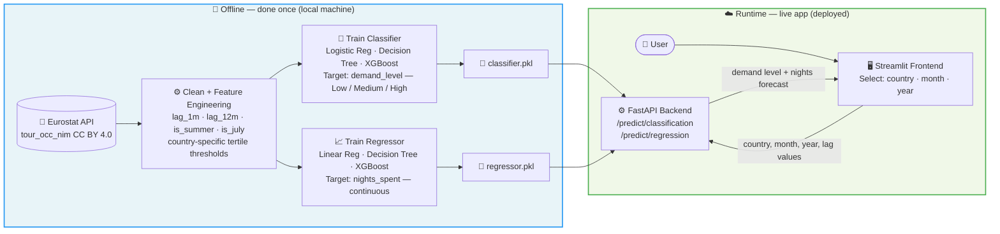

# EU Campsite Demand Forecasting — Solution Architecture

## Mermaid Source

## Written Explanation

Training happens entirely offline, on a local machine, as a one-time step before deployment. The Eurostat `tour_occ_nim` dataset is downloaded, cleaned, and enriched with lag features (`lag_1m`, `lag_12m`), seasonal flags (`is_summer`, `is_july`), and country-specific tertile thresholds to derive the `demand_level` target. Two models are trained — a classifier (predicting Low / Medium / High demand) and a regressor (predicting the raw number of nights spent) — and both are saved to disk as `classifier.pkl` and `regressor.pkl`. At runtime, the FastAPI backend loads those two saved files once on startup and exposes two prediction endpoints (`/predict/classification` and `/predict/regression`); no retraining ever happens in the live app. When a user selects a country, month, and year in the Streamlit frontend, the feature values are sent to the backend, which calls `model.predict()` on both models and returns the demand level label and the nights-spent forecast back to the browser.
